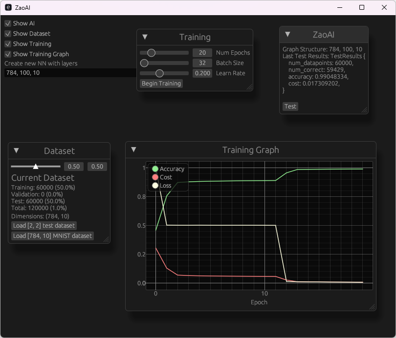

# zaoai
Z Anime Opening AI

# This project is still in its infancy stage
Features at this moment:
    * Create neural networks with any graph layout
    * Train that network using backpropegation
    * Provides a interactive UI
    * SIMD optimized (30 epochs for [784, 100, 10] network takes a few seconds locally)

# Goal of this application:
Input a anime video file, add chapter timestamps for it for OP start/end & ED start/end.
This will be done by analyzing mainly the audio.

# TODO:
## Figure out how to train AI
### First
Implement helper scripts to gather dataset
### Then
Current plan is to utilize sliced ffts to train from the video with two output lables that marks the frame numbers where the opening is. 

## Support Audio Formats
    * mkv
    * mp4?

## Zaoai Helper
    * Add chapters to video file
    * Gather training data

## AI:
    * Save/load networks
    * Dropout neurons (Prune network during training)
    * Cross-validation
    * Eigen vectors? (reduce amount of input tensors)
    * Gradient descent momentum 
    * Gradients add noise
    * Noise inputs
    * Learning Rate Decay
    * Expose random seed to user
    * GPU computation

## AI suggested todo:
* ✅ Weight Initialization	Avoids vanishing/exploding gradients	Use Xavier/He
* ✅ Gradient Clipping	Prevents exploding gradients (especially RNNs/deep nets)	Max-norm clip
* ✅ Adam Optimizer	Faster convergence than SGD + momentum	Implement next
* ✅ Learning Rate Warm-up	Helps when starting with high learning rates	Optional but useful
* ✅ Batch Normalization	Speeds up training, stabilizes gradients	Add to roadmap
* ✅ Seed for RNG	Makes training reproducible/debuggable	Global + local RNG
* ✅ Early Stopping	Prevents overfitting, saves training time	Based on val loss
* Mixed precision (f16/f32)	For speed/memory gains, GPU-focused
* Model export (ONNX/custom)	Deployment-ready models
* Gradient checking (finite diff)	Validate your backprop implementation

