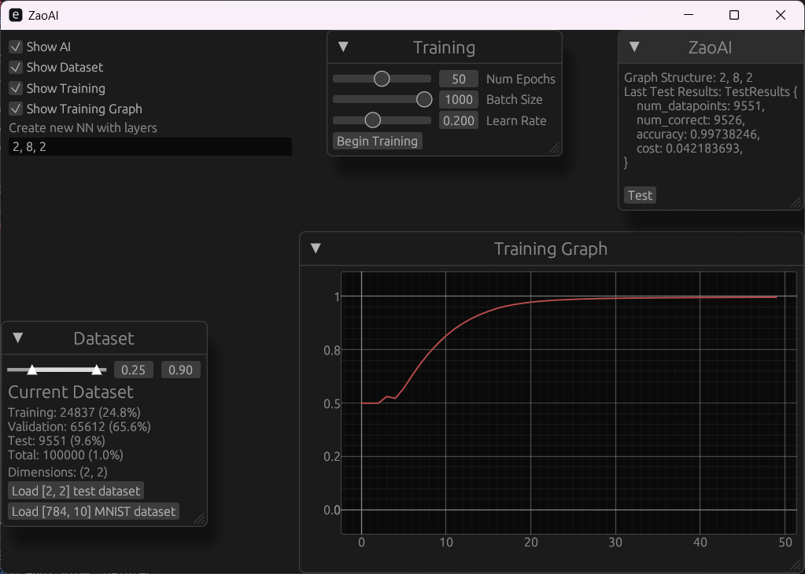

# zaoai
Z Anime Opening AI

# This project is still in its infancy stage
At this moment it can only:
    1. Create neural network that can perform backpropegation
    2. Train that network
    3. Provides a interactive UI

# Goal of this application:
Input a anime video file, add chapter timestamps for it for OP start/end & ED start/end.
This will be done by analyzing mainly the audio.

# Features TODO list:
Support Audio Formats
    * mkv
    * mp4

## TODO:
    * fix mnist not lagging
    * fix WindowTraining____ UI structs
    * avoid cloning of TrainingDataset

    Create ML AI
        * Save/load weights
        * Dropout neurons
        * Cross-validation
        * MNIST
        * Eigen vectors? (reduce amount of input tensors)
        * Gradient dedcent momentum & decay
        * Add noise
        * Visualize output over time
    Add chapters to video file
    Gather training data
    Figure out how to train AI