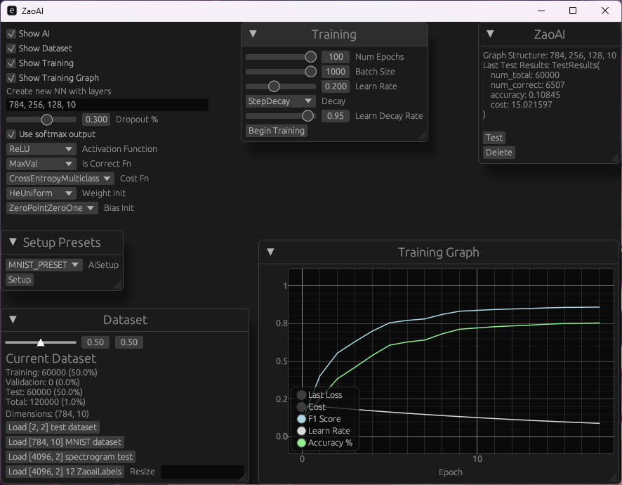

# ZaoAI – Z Anime Opening AI

> ⚠️ This project is in early development.

## Project Goal
Input an anime video file and automatically mark:
- **OP (Opening)** start/end
- **ED (Ending)** start/end  
Based primarily on **audio analysis**.

## Current Features
- Create neural networks with format "**[In]748, 400, [Out]10**"
- Train networks using **backpropagation**
- SIMD-optimized
  - Example: 30 epochs of [784, 100, 10] finishes in seconds
  - (GPU integration on it's way)
- Interactive UI
- Training metrics tracking
- Cached three stage processing

## Usage
> ⚠️ This project is in early development.

1. [zaoai-helper] Collect file names in **{DIR}** to **list_dir.json**
2. [zaoai-helper] Construct **.zlbl**s & **.spectrogram** from **list_dir.json**
3. [zaoai] Run zaoai and Load **.zlbl**s to train ai

### Zaoai
> Working directory: zaoai/zaoai

### Zaoai-Helper
> Working directory: zaoai/zaoai-helper

## Roadmap

### Phase 1 – Dataset Preparation
- [x] zaoai-helper to extract training data
- [x] Chapter annotation tools for OP/ED regions

### Phase 2 – Training Pipeline
- [x] Use sliced FFTs of audio as input
- [x] Train using labels of normalized time to identify opening start/end segments

### Phase 3 - Optimize Training
- [ ] gpu integration
- [ ] zaoai accuracy 50%
- [ ] zaoai accuracy 75%
- [ ] zaoai accuracy 90%
- [ ] zaoai accuracy 95%

### Phase 4 - Post Ai working work
- [ ] Workflow to use ai to add chapters to files

## Crates
> ⚠️ This project is in early development.
### zaoai
Main crate, contains neural network code and gui for interaction

### zaoai-types
Crate with common datatypes & functionality, currently stuff is just crammed in here.

### zaoai-helper
Contains script-like executables for preparing & maintaining files needed for zaoai. Such as converting .mkv files to .zlbl/.spectrogram files
