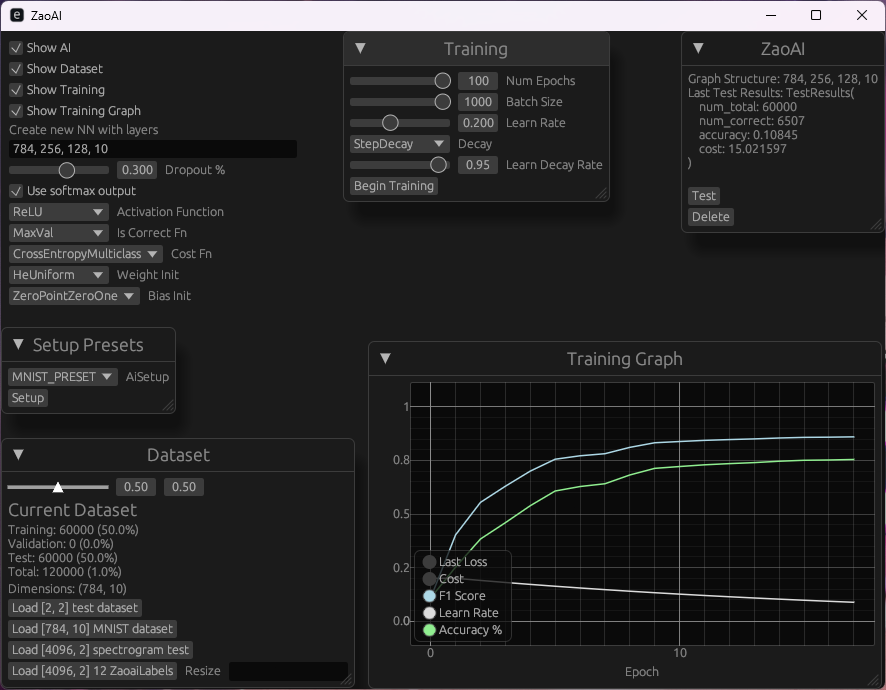

# ZaoAI – Z Anime Opening AI

> ⚠️ This project is in early development.

## Current Features
- Create neural networks with format **[In]748, 400, [Out]10**
- Train networks using **backpropagation**
- SIMD-optimized
  - Example: 30 epochs of [784, 100, 10] finishes in seconds
- Interactive UI (built with `eframe`)
- Training metrics tracking

## TODO:
### Support Audio Formats
- mkv
- mp4?

### Zaoai Helper
- Add chapters to video file

### AI:
- Dropout neurons (Prune network during training)
- Cross-validation
- Eigen vectors? (reduce amount of input tensors)
- Gradient descent momentum 
- Gradients add noise
- Noise inputs
- Learning Rate Decay
- Expose random seed to user
- GPU computation

### AI suggested todo:
- ✅ Weight Initialization	Avoids vanishing/exploding gradients	Use Xavier/He
- ✅ Gradient Clipping	Prevents exploding gradients (especially RNNs/deep nets)	Max-norm clip
- ✅ Adam Optimizer	Faster convergence than SGD + momentum	Implement next
- ✅ Learning Rate Warm-up	Helps when starting with high learning rates	Optional but useful
- ✅ Batch Normalization	Speeds up training, stabilizes gradients	Add to roadmap
- ✅ Seed for RNG	Makes training reproducible/debuggable	Global + local RNG
- ✅ Early Stopping	Prevents overfitting, saves training time	Based on val loss
- Mixed precision (f16/f32)	For speed/memory gains, GPU-focused
- Model export (ONNX/custom)	Deployment-ready models
- Gradient checking (finite diff)	Validate your backprop implementation